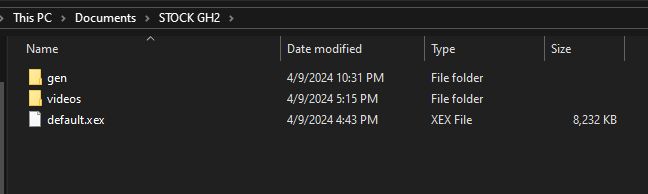
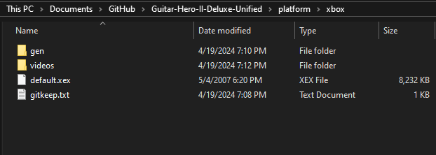

# Guitar Hero 80s for Xbox 360

## Welcome to the Future of GH80s!!!

##THIS MOD IS *IN* PRE-ALPHA, EXPECT BUGS AND PS2 TO NOT WORK

#BACKGROUND:
	For a good ammount of time, GH2DX360 was far too unstable, notable issues were that of the score meter having the score be out of allignment,
campaign mode was broken, same for the more stats screen, and far to many more to get into here. TL;DR GH2DX360 was inherently Broken, and while many 
features were beneficial to GH2DX360 (Custom highway textures, color themes, PoorSpy ETC.), it was determined that it would be better for the project
as a whole if the entierty of GH2DX's code was re-written with the knowledge Milohax has gained from the many other DX projects (Play Rock Band 3 Deluxe).
Guitar Hero 80s for Xbox 360 (GH80s x360) is in a manner of speaking a "Remastered" version of Guitar Hero Rocks the 80's, on Xbox 360

#INSTALLATION:
	-GH80s x360 is in PRE-ALPHA, so the install process is *subject to change*. Currently there is 2 flavors of GH80s x360, PS2 and Xbox-360.

#XBOX 360
	-GH80s x360 for Xbox-360 WILL require the following:
	-Python
	-Access to a CMD prompt
	-A "legally" aquired copy of stock GH2 for the Xbox-360.

	-1. ENSURE YOUR COPY OF GH2 IS IN A RAW-FILE FORMAT (Refer to the picture below)

	-2. Take your GH2 Raw Files and Place them within `Guitar-Hero-II-Deluxe-Unified\platform\xbox` (it should look like the picture below, DO NOT DELETE ANYTHING
ALREADY IN THE FOLDER)

	-3. Once it is installed, located the `scripts` folder in the root of the Repository, in this folder run `build_xbox.bat`. A CMD prompt will now open.
	-4. Upon completion of the creation of the DX patch, a new folder called `out` should have opened, you now have offically survived the process of creating
your very own copy of GH80s x360 for the Xbox-360! Congrats!
	-5. Now here is the easy part, you remember that copy of stock GH2 you legally aquired, well make a copy of those files, and in this new copy of GH2
simply drag the newly created `GEN` and `default.xex` files/folders (for those who prefer their GH2 with overscan you can rename `default no overscan.xex` to 
default.xex after getting rid of the OG default.xex) over to your copy of stock GH2.
	-6. You have offically created your own GH80s x360 copy. Now you can use this copy of GH80s x360 on any platform where 360 Games can be ran
	